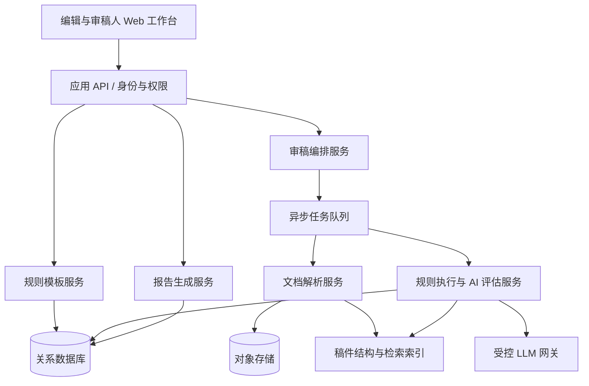
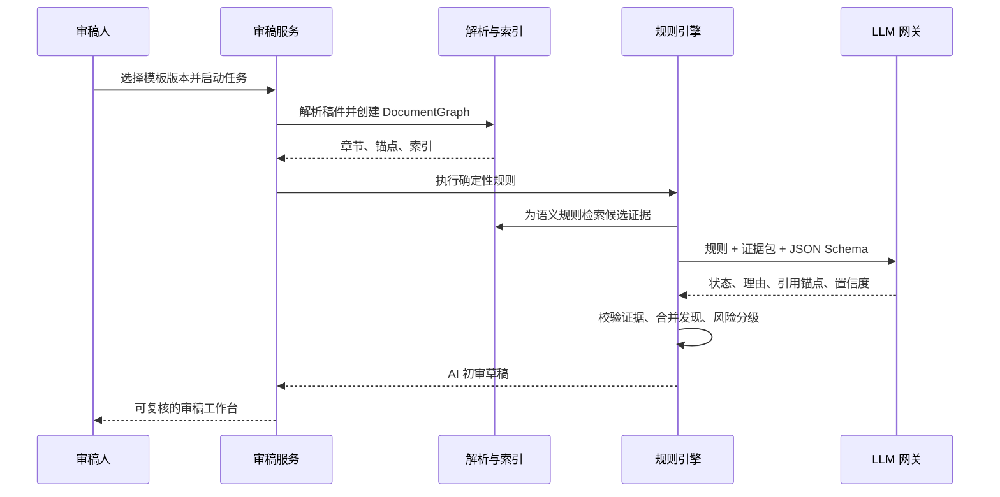

# 综述审稿助手技术方案

## 1. 设计目标

本方案实现“规则可配置、审稿可解释、人工可覆盖”的自动初审平台。核心不是让大模型一次性写审稿意见，而是将期刊清单编译为结构化规则，并按规则逐项检索、判定和回链证据。

## 2. 总体架构



建议采用模块化单体起步：前端、API、任务 Worker、文档解析器和模型网关逻辑边界清晰，但可先部署在同一套工程和数据库中。文档解析/OCR、长任务和报告渲染通过队列异步执行；当量级增长时，再独立扩展 Worker。

## 3. 关键领域模型

### 3.1 规则模型

```json
{
  "id": "narrative.methods.search-date",
  "templateVersion": "ame-narrative-review@1.0.0",
  "dimension": "methods",
  "title": {"zh": "检索日期精确到年月日", "en": "Search date is reported to day precision"},
  "ruleType": "semantic_presence",
  "severity": "major",
  "required": true,
  "appliesWhen": "article_type == 'narrative_review'",
  "evaluation": {
    "targetSections": ["Methods", "Search strategy"],
    "question": "Does the manuscript report the literature search date with year, month and day?",
    "expectedEvidence": ["date"]
  },
  "reportText": {"zh": "请报告精确检索日期（年/月/日）。", "en": "Please report the precise literature-search date (year/month/day)."},
  "source": {"file": "综述清单.pdf", "page": 4, "label": "5.1"}
}
```

规则类型建议如下：

| 类型 | 执行方式 | 例子 |
| --- | --- | --- |
| `metadata` | 文档属性/固定位置提取 | 作者、通讯作者、资金声明 |
| `count` | 确定性计数 | 关键词 3–5 个、字数上限 |
| `structure` | 章节树和标题匹配 | 是否有结论、引言三个子项 |
| `cross_reference` | 跨区域比对 | 图表是否在正文引用、正文/参考文献一致性 |
| `semantic_presence` | 检索证据 + LLM 受控判定 | 是否说明 knowledge gap |
| `semantic_quality` | 证据包 + 评估量表 | 结论是否被正文支撑 |
| `external_review` | 生成待核验任务 | 图表版权、图片实际清晰度 |

### 3.2 稿件统一模型

DOCX 与 PDF 需要转为统一的 `DocumentGraph`：

- `Document`：稿件、语言、总词数、解析版本；
- `Section`：标题、层级、逻辑类型、文本块；
- `Block`：段落、表格、图、图例、参考文献、脚注；
- `Anchor`：DOCX 段落/字符范围，或 PDF 页码/坐标范围；
- `Citation`：正文引用标记、参考文献条目、关联关系；
- `Asset`：图表、图像、附件与基本属性。

所有 AI 输出只能引用已有 Anchor。这个约束是可解释审稿的底座。

## 4. 文档与规则导入管线

### 4.1 清单导入

1. 文件安全扫描、格式识别和对象存储；
2. DOCX 读取段落/表格/标题样式，Excel 读取工作表/行列，PDF 做版面文字提取和 OCR；
3. 生成带来源位置的中间表示（清单段、表格单元格、页码）；
4. 使用 LLM 将中间表示转成候选规则 JSON；
5. 规则校验器检查字段完整性、重复、过宽规则和不可执行规则；
6. 编辑在工作台确认、编辑后发布版本。

AI 输出须符合 JSON Schema。解析失败或不确定项目进入待确认，不得被静默丢弃。

### 4.2 稿件导入

DOCX 采用 OOXML 解析，保留标题层级、表格单元格、脚注、图片及段落锚点。PDF 采用文本/版面解析；扫描件走 OCR，保留原页图像与坐标。章节分类宜采取“样式/标题规则优先 + LLM 兜底”的方式，避免单凭模型猜测章节。

## 5. 审稿执行管线



### 5.1 确定性规则优先

词数、关键词数量、运行标题长度、章节存在性、标题名禁用、图表引用、参考文献编号和日期格式，应由程序直接处理。模型只处理必须理解语言语义的部分。

### 5.2 受控 AI 语义判定

一次模型调用只处理一条规则或一组紧密相关规则，输入限定为：规则定义、章节上下文、检索命中的证据片段、输出语言和 JSON Schema。模型不接收不相关全文，不自行编造来源。

建议输出：

```json
{
  "status": "partial",
  "confidence": 0.78,
  "rationale": "Methods reports databases and keywords but does not identify reviewers or consensus procedure.",
  "evidenceAnchors": ["section:methods/p:3", "section:methods/p:5"],
  "missingElements": ["independent screening", "consensus process"],
  "suggestion": "State who screened records, whether screening was independent, and how disagreements were resolved."
}
```

服务端在保存前校验：锚点必须存在；理由必须与规则相符；“到位”不能无证据；低于阈值时将状态改为 `uncertain`，进入人工复核。

### 5.3 结论支持性检查

“结论是否有数据/正文支持”不应交给全文自由问答。可分解为：抽取结论中的主张 -> 在主体/表格/引用中检索支持或限定语 -> LLM 对主张与证据的关系评分 -> 输出“支持充分、部分支持、未找到支持、无法判断”。每条主张有自己的证据链。

## 6. 数据存储与接口边界

关系数据库保存用户、期刊、模板版本、规则、任务、发现、复核记录和审计日志；对象存储保存原始稿件、解析中间件和导出报告；检索索引保存块文本、向量、Anchor 与元数据。

建议 API 边界：

| 资源 | 典型接口 |
| --- | --- |
| 模板 | `POST /templates/imports`、`GET /templates/{id}/draft`、`POST /template-versions/{id}/publish` |
| 稿件 | `POST /manuscripts`、`GET /manuscripts/{id}/parse-status` |
| 审稿 | `POST /reviews`、`GET /reviews/{id}`、`POST /reviews/{id}/rerun` |
| 发现 | `GET /reviews/{id}/findings`、`PATCH /findings/{id}/decision` |
| 报告 | `POST /reviews/{id}/exports`、`GET /exports/{id}` |

接口需以期刊作为租户边界，所有读写先做身份、期刊成员资格和资源归属校验。

## 7. 质量、评估与可观测性

### 7.1 规则测试

每条硬规则应有通过、失败、边界和不适用样例。比如关键词规则至少覆盖 2、3、5、6 个关键词及无关键词标题的稿件。

### 7.2 AI 评估集

建立经资深编辑标注的匿名历史稿件集。每条语义规则评估状态准确率、严重缺失召回率、错误提示率、证据定位正确率和审稿人接受率。按期刊和文章类型分层统计，避免单一数据集掩盖偏差。

### 7.3 在线监控

记录解析成功率、各步骤耗时、模型失败率、JSON Schema 失败率、低置信度比例、人工覆盖率与规则接受率。模板或提示词变更应做灰度和回归评估，不能只看模型回答是否“像人”。

## 8. 安全与合规

- 未公开稿件、作者信息、审稿意见视为高敏感业务数据；
- 文件上传进行 MIME/魔数校验、病毒扫描、压缩包炸弹防护和大小/页数限制；
- 原始文件和导出件采用加密存储，下载链接短时有效；
- LLM 网关禁止使用用户稿件训练模型；记录模型版本和最小必要调用审计；
- 提示词、规则文本和文档内容均视为不可信输入，防范提示词注入：模型仅执行系统定义 JSON 任务，不执行稿件中的指令；
- 支持按期刊配置数据保留期、人工删除和导出审计。

## 9. 关键技术决策

| 决策 | 选择 | 原因 |
| --- | --- | --- |
| 审稿主线 | 规则引擎编排 + LLM 语义判定 | 可解释、可测试、可适配多期刊 |
| 规则真源 | 已发布模板版本 | 保证历史结果可复现 |
| 文档定位 | DocumentGraph + Anchor | 支持 DOCX/PDF 统一证据回链 |
| AI 输出 | 受 JSON Schema 约束 | 降低自由生成和难解析输出 |
| 长任务 | 异步队列与幂等任务 | 防止请求超时并支持重试 |
| 模型不确定性 | `uncertain` 状态和人工队列 | 不把推测伪装为审稿结论 |

## 10. 实施顺序

1. 定义规则 JSON Schema、Narrative Review 基线模板和样例稿件；
2. 实现 DOCX/PDF 统一解析、DocumentGraph 与 Anchor；
3. 实现规则模板导入草稿和编辑发布；
4. 实现硬规则执行器与可视化结果；
5. 加入证据检索、受控 LLM 语义判定与人工复核；
6. 生成双语报告，建立评估集、监控和安全审计；
7. 以试点期刊真实但脱敏的稿件进行验收，再扩展新模板。
